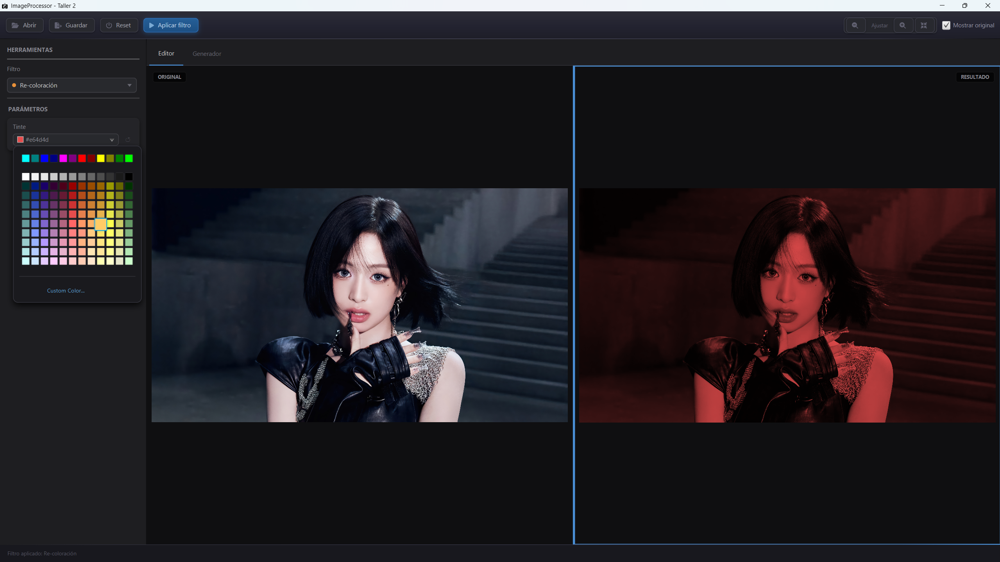

# ImageProcessor

Aplicación de escritorio en **Java 21 + JavaFX 21** para edición no destructiva de imágenes, con interfaz oscura profesional inspirada en Adobe Lightroom / DaVinci Resolve.



---

## Características

- **Edición no destructiva** — la imagen original nunca se altera en memoria.
- **Catálogo completo de filtros** — ajustes básicos, transparencia, retro/cuantización y convolución espacial.
- **Zoom independiente por panel** — rueda del ratón + botones de toolbar; cada vista (original / resultado) tiene su propio nivel de zoom.
- **Comparador antes/después** — modo 50/50 con borde de foco que indica el panel activo.
- **Generador de degradados** — crea imágenes sintéticas lineales y radiales desde cero.
- **Exportación flexible** — formato detectado automáticamente por la extensión elegida (`png`, `jpg`, `bmp`, `gif`).

---

## Requisitos

| Requisito | Versión mínima |
|---|---|
| JDK | 21 |
| Maven | 3.6+ (o usar `mvnw` incluido) |
| Sistema operativo | Windows / macOS / Linux con soporte OpenGL |

> No se requiere instalar JavaFX por separado. Maven descarga las dependencias automáticamente.

---

## Instalación y ejecución

### 1. Clonar el repositorio

```bash
git clone <https://github.com/Erenriquezp/ImageProcessor.git>
cd ImageProcessor
```

### 2. Compilar

```bash
# Linux / macOS
./mvnw clean compile

# Windows
.\mvnw.cmd clean compile
```

### 3. Ejecutar la aplicación

```bash
# Linux / macOS
./mvnw javafx:run

# Windows
.\mvnw.cmd javafx:run
```

### 4. Ejecutar los tests

```bash
./mvnw test
```

---

## Uso básico

### Abrir una imagen

1. Haz clic en **Abrir** en la barra superior.
2. Selecciona un archivo `png`, `jpg`, `jpeg`, `bmp` o `gif`.
3. La imagen se muestra en el área central (pestaña **Editor**).

### Aplicar un filtro

1. Selecciona un filtro en el ComboBox **Filtro** del panel izquierdo.
2. Ajusta los parámetros que aparecen dinámicamente (slider, spinner, color picker o checkboxes).
3. Haz clic en **Aplicar filtro**.

### Comparar antes y después

1. Activa el checkbox **Mostrar original** para ver ambas imágenes en paralelo (modo 50/50).
2. En modo comparar, cada panel tiene **zoom independiente**:
   - Haz scroll sobre un panel para hacer zoom sólo en él.
   - Haz clic en un panel para marcarlo como **activo** (borde azul) — los botones de zoom de la toolbar se aplican al panel activo.
3. Desactiva el checkbox para volver a la vista simple.

### Zoom

| Acción | Resultado |
|---|---|
| Scroll ↑ sobre un panel | Zoom in en ese panel |
| Scroll ↓ sobre un panel | Zoom out (mínimo: ajustar a ventana) |
| Botón `+` / `−` en toolbar | Zoom in/out en el panel activo |
| Botón ⊞ o click en el indicador | Resetea el zoom a "Ajustar a ventana" |
| Arrastrar con botón izquierdo | Panear (disponible cuando hay scrollbars) |

### Resetear

- Haz clic en **Reset** para descartar los cambios y volver a la imagen original cargada.

### Guardar

1. Haz clic en **Guardar**.
2. Escribe el nombre del archivo con la extensión deseada (`.png`, `.jpg`, `.bmp`, `.gif`).
3. El formato se detecta automáticamente por la extensión.

> **Nota:** el canal alpha (transparencia) sólo se preserva al guardar como `.png`.

---

## Generador de degradados

1. Navega a la pestaña **Generador**.
2. Selecciona el **Tipo** de degradado (Izquierda→Derecha, Derecha→Izquierda, Arriba→Abajo, Abajo→Arriba, Radial).
3. Ajusta el **Ancho** y el **Alto** en píxeles.
4. Elige el **Color inicial** y el **Color final** con los color pickers.
5. Haz clic en **Generar degradado** para previsualizar.
6. Usa **Usar en editor** para enviar el degradado al editor y aplicarle filtros.

---

## Filtros disponibles

### Ajustes básicos

| Filtro | Parámetro(s) |
|---|---|
| Escala de grises | — |
| Negativo | — |
| Brillo / Oscuridad | Slider de valor (−100 a +100) |
| Ajuste HSV | Slider de Saturación (0–2) y Slider de Valor (0–2) |
| Blanco y negro (umbral) | Slider de umbral (0–255) |
| Recolorización | Color picker de tinte |

### Efectos de transparencia (canal alpha)

| Filtro | Parámetro(s) | Descripción |
|---|---|---|
| Vidrio esmerilado | — | Alpha proporcional al brillo local de cada píxel |
| Desvanecimiento circular | — | Viñeta: opaco en el centro, transparente en los bordes |
| **Transparencia global** | Slider de Alpha (0–255) | Alpha uniforme aplicado a toda la imagen |

### Estética retro y cuantización

| Filtro | Parámetro(s) | Descripción |
|---|---|---|
| Retro 1 (cuantización RGB) | Spinner de niveles (2–255) | Reduce los colores de los tres canales a N niveles |
| **Retro 2 (glitch canales)** | Spinner de niveles + Checkboxes R / G / B | Cuantiza sólo los canales seleccionados; los demás quedan intactos — efecto "glitch" |
| **Grises cuantizados** | Spinner de niveles (2–64) | Escala de grises reducida a N bandas de tono marcadas |
| Reducción 4 bits + estiramiento | Combo: Binario / Decimal / Hexadecimal | Comprime a 4 bits y estira el rango de vuelta a 8 bits |

### Filtros espaciales (convolución 3×3)

| Filtro | Kernel | Descripción |
|---|---|---|
| Blur | Promedio uniforme 3×3 | Desenfoque suave |
| Sharpen | Laplaciana de la Gaussiana | Realce de bordes y contraste local |
| Detección de bordes | Gradiente Sobel simplificado | Resalta contornos |
| Emboss | Matriz de relieve en diagonal | Efecto 3D / bajorrelieve |

---

## Estructura del proyecto

```
src/main/java/com/example/imageprocessor/
├── app/
│   ├── ImageProcessorApp.java          # Coordinador principal y punto de entrada (JavaFX Application)
│   └── ui/
│       ├── EditorPreviewPane.java      # Panel de preview: scroll panes, compare mode, zoom independiente
│       ├── TopBar.java                 # Barra de herramientas: botones de acción y controles de zoom
│       ├── EditorFilterPane.java       # Panel izquierdo: selector de filtro y controles dinámicos
│       ├── GradientGeneratorPane.java  # Pestaña del generador de degradados
│       └── ImageFileChooserFactory.java  # Fábrica de diálogos de apertura y guardado
├── domain/
│   ├── FilterType.java                 # Enum de todos los filtros disponibles
│   ├── ConvolutionKernel.java          # Kernels de convolución predefinidos
│   ├── GradientType.java               # Tipos de degradado
│   └── StretchMode.java                # Modos de estiramiento de 4 bits
└── service/
    ├── ImageProcessor.java             # Fachada pública de procesamiento (API estable)
    ├── ColorFilters.java               # Filtros de color básicos (grises, brillo, HSV, alpha…)
    ├── ArtisticFilters.java            # Efectos artísticos, cuantización y transparencia
    ├── ConvolutionFilters.java         # Convolución espacial 3×3
    ├── GradientGenerator.java          # Generación de degradados sintéticos
    ├── ImageIOService.java             # Lectura y escritura de archivos
    └── PixelMath.java                  # Utilidades matemáticas internas (clamp, lerp, quantize)
```

### Arquitectura en capas

```
┌─────────────────────────────────────────────────┐
│  app/  (Presentación y coordinación)             │
│  ┌─────────────────┐  ┌──────────────────────┐  │
│  │ ImageProcessorApp│  │  ui/ (componentes)   │  │
│  │ - Estado sesión  │←→│  EditorPreviewPane   │  │
│  │ - Ops. imagen    │  │  TopBar              │  │
│  │ - Cableado UI    │  │  EditorFilterPane    │  │
│  └────────┬─────────┘  │  GradientGeneratorPane│ │
│           │             └──────────────────────┘  │
├───────────┼─────────────────────────────────────┤
│  service/ │ (Lógica pura, sin estado)            │
│  ImageProcessor ← fachada pública               │
│  ColorFilters · ArtisticFilters                  │
│  ConvolutionFilters · GradientGenerator          │
│  ImageIOService · PixelMath                      │
├─────────────────────────────────────────────────┤
│  domain/  (Tipos y enumeraciones)               │
│  FilterType · ConvolutionKernel                  │
│  GradientType · StretchMode                      │
└─────────────────────────────────────────────────┘
```

---

## Tecnologías

| Tecnología | Versión | Rol |
|---|---|---|
| Java | 21 (LTS) | Lenguaje base |
| JavaFX | 21.0.6 | Interfaz gráfica de escritorio |
| javafx-swing | 21.0.6 | Puente `BufferedImage ↔ Image` via `SwingFXUtils` |
| AWT / java.desktop | JDK 21 | Procesamiento de `BufferedImage` y operaciones de color |
| Ikonli (FontAwesome 6) | 12.4.0 | Iconos vectoriales en la toolbar |
| Maven | 3.x | Build y gestión de dependencias |
| JUnit Jupiter | 5.12.1 | Tests unitarios |
